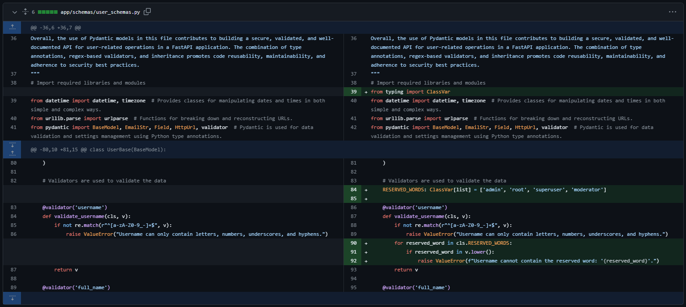
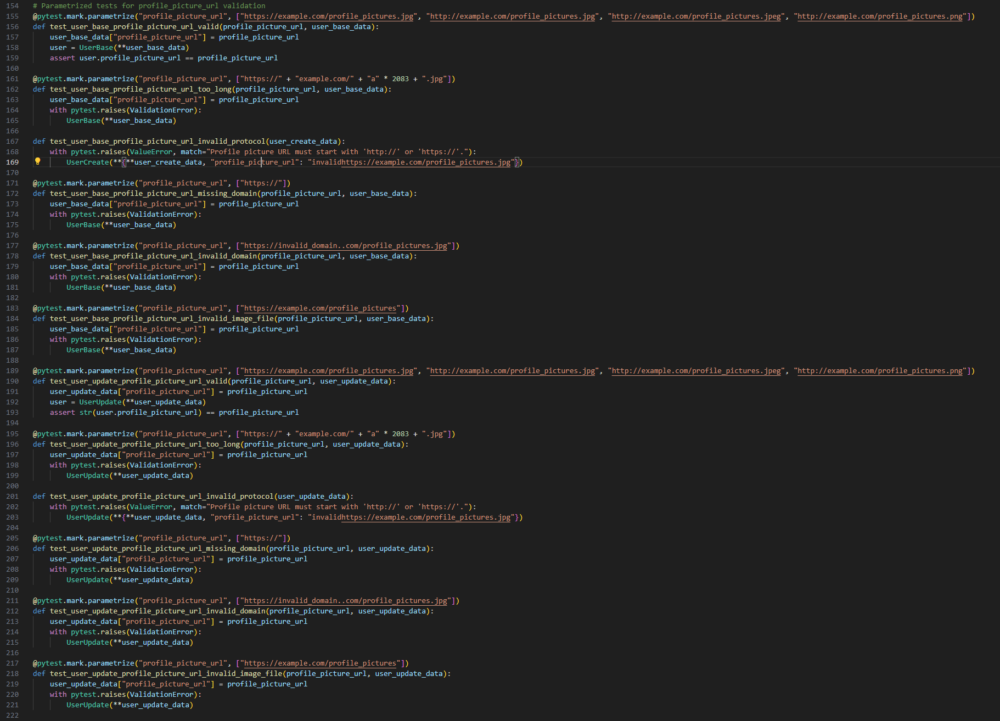
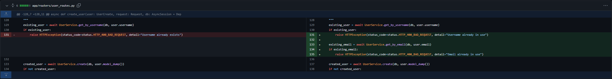
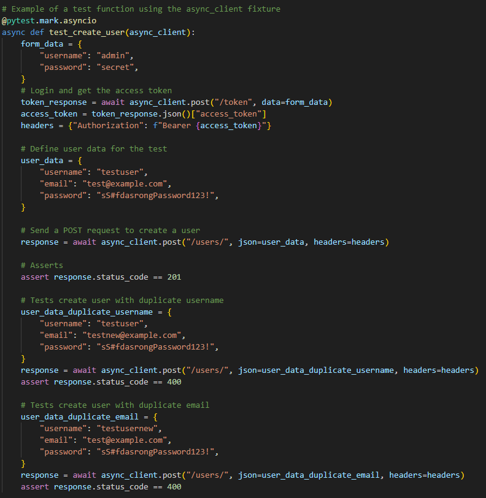
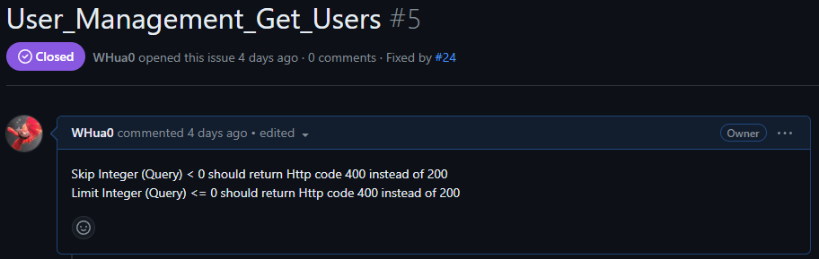
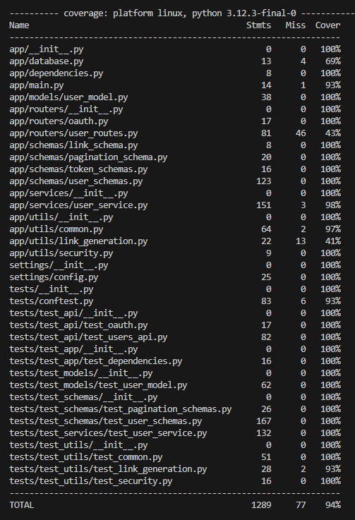

# Event Manager Practice

## Closed Issues
Github Issue Image Placeholder

[Github Closed Issues Link](https://github.com/WHua0/event_manager_practice/issues?q=is%3Aissue+is%3Aclosed)

### Closed Issue 1: Settings Max Login Attempts Description is Incorrect

[Github Issue 1 Link](https://github.com/WHua0/event_manager_practice/issues/10)

Description for max_login_attempts in class Settings in config.py incorrectly stated "Background color of QR codes". The description is updated to "Max number of login attempts".

### Closed Issue 2: Username Validation for Reserved Words

[Github Issue 2 Link](https://github.com/WHua0/event_manager_practice/issues/27)

POST/register Register and POST/users Create User allowed usernames to have any word, including explicit words. Username validator in class UserBase in user_schemas.py is updated to return ValueError if username contains reserved words. This is to increase security, and reduce profanity.

### Closed Issue 3: Password Validation is Missing No Spaces Allowed and Max Length

[Github Issue 3 Link](https://github.com/WHua0/event_manager_practice/issues/4)

POST/register Register and POST/users Create User allowed passwords with spaces, and of unlimited lengths. Password validator in class UserCreate in user_schemas.py is updated to return ValueError if length of password is over 128 characters, or if a space is found within the password. This is to increase security.

### Closed Issue 4: Email Validation is Missing Max Length

[Github Issue 4 Link](https://github.com/WHua0/event_manager_practice/issues/8)

POST/register Register and POST/users Create User allowed emails of unlimited lengths. Email in class UserBase in user_schemas.py is updated to have a maxlength of 255. This is to increase security.

### Closed Issue 5: Profile Picture Url Validation is missing Max Length, HTTPS/HTTP protocol, and Valid Domain 

[Github Issue 5 Link](https://github.com/WHua0/event_manager_practice/issues/7)

POST/register Register and POST/users Create User allowed Profile Picture Url of no restriction except with image file extension. Profile Picture Url validator in class UserBase and class UserUpdate in user_schemas.py are updated to return ValueError if url is missing http or https, missing domain name, or containing an invalid domain name. Max Length of 2083 is also added to UserBase BaseModel. This is to increase security.

### Closed Issue 6: POST/register JSON Schema Example is Inconsistent

[Github Issue 6 Link](https://github.com/WHua0/event_manager_practice/issues/1)

In POST/register Register request body, the test user is John Doe, however the test profile picture url was for Jane Smith.Class Config in class UserBase in user_schemas.py is corrected to reflect the test profile picture url of John Doe. This is for consistency.

### Closed Issue 7: POST/register HTTP 400 Detail Message is Missing Email Already In Use

[Github Issue 7 Link](https://github.com/WHua0/event_manager_practice/issues/3)

POST/register Register HTTP 400 detail message stated "Username already exists" even when duplicate email returned HTTP 400. HTTPException detail in Router Post Register in user_routes.py is corrected to "Username or Email already in use". This is to provide an accurate error message.

### Closed Issue 8: POST/users Create User is Missing HTTP 400 and Detail Message for Email Already In Use, and Update Detail Message for Duplicate User

[Github Issue 8 Link](https://github.com/WHua0/event_manager_practice/issues/12)

POST/users Create User returns HTTP 500 instead of HTTP 400 when using a duplicate email. Router Post Create User in user_routes.py is updated to return HTTP 400 "Email already in use" when using a duplicate email after checking for a duplicate username. This is to provide an accurate error message.

POST/users Create User HTTP 400 detail message stated "Username already exists" when using a duplicate username. HTTPException detail in Router Post Create User in user_routes.py is updated to "Username already in use". This is for consistency with POST/register Register in Closed Issue 7.

### Closed Issue 9: POST/users Get User is Missing Return Values for Full Name, Bio, and Profile Picture Url

[Github Issue 9 Link](https://github.com/WHua0/event_manager_practice/issues/9)

GET/users Get User By ID returned incorrect null values for Full Name, Bio, and Profile Picture Url for existing user. Router Get User By ID in user_routes.py is updated to return the three missing values from the User database.

### Closed Issue 10: POST/users Get Users is Missing HTTP 400 for Skip Integer Less Than 0, and Limit Integer Not More Than 0

[Github Issue 10 Link](https://github.com/WHua0/event_manager_practice/issues/5)

GET/users List User returned HTTP 200 for Skip Integer less than 0, and Limit Integer not more than 0. Router List Users in user_routes.py is updated to return HTTP 400 instead of HTTP 200 for invalid input. This is to provide an accurate error message.

### Closed Issue 11: PUT/users Update User is Not Functional

[Github Issue 11 Link](https://github.com/WHua0/event_manager_practice/issues/6)

PUT/users Update User By ID returned HTTP 200 without updates to the User Database. As such, numerous steps were made to separate out the code to detect and fix errors:

In user_routes.py, Router Update User By ID

1. Added a Fetched User Information and Check if User Exists; if user is None, return HTTP 404 "User Not Found".
2. Corrected if not updated_user to return HTTP 500 "Failed to update user", instead of HTTP 404.
3. Added a Check if Updated Email is already in use by another User; if yes, return HTTP 400 "Email already in use".

By checking logs, it was found that the database query does not accept Url's, as such:

4. In user.services.py, classmethod update, added if profile_picture_url exist, convert url to a string before interacting with the database.

In user_schemas.py, UserUpdate:

5. Added a full name validator and updated json_schema_extra to reflect the change.

6. Previously updated profile picture url validator from Closed Issue 5.

7. Updated BaseModel to mirror UserBase(BaseModel) Previous Updates from Closed Issues 4 & 5: Max Length for Email and Profile Picture Url.

PUT/users Update User By ID is working as intended with updates to the database.

## Dockerhub
 

## Pytest Coverage

## Reflection
Documentation